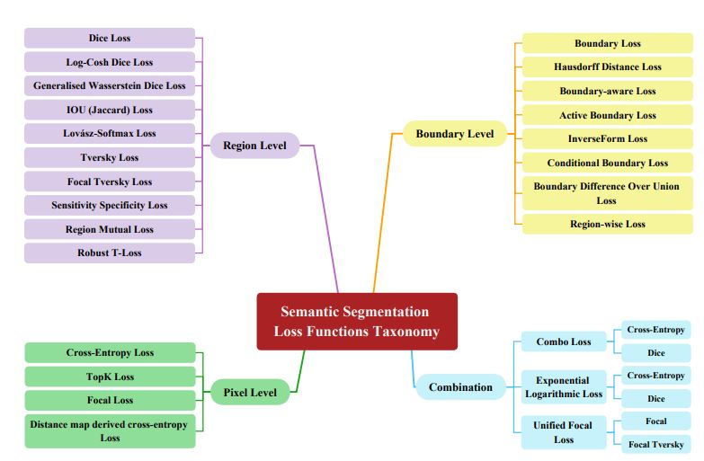
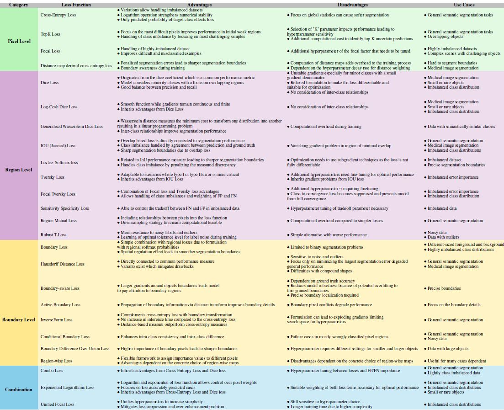

# Loss_Functions


## 1 Introduction

```
Image segmentation plays a fundamental role in a wide range of visual understanding systems. Its primary objective is
to generate a dense prediction for a given image,i.e., assigning each pixel a pre-defined class label (semantic segmenta-
tion) [ 1 , 2 ], or associating each pixel with an object instance (instance segmentation) [ 3 ], or the mixture of both (panoptic
segmentation) [ 4 ], which facilitates the organization of pixels with similar semantics into meaningful high-level concepts.
Segmentation has a wide range of applications in a variety of domains including medical image analysis [ 5 , 6 ], video
```
 Reference : https://github.com/YilmazKadir/Segmentation_Losses
 https://arxiv.org/abs/2312.05391


## Segmentation



```
Table 1: Notation for Segmentation Loss
```
### Symbol Description

- N Number of pixels

- C Number of target classes

- tn One-hot encoding vector representing the target class of thenthpixel.

- tcn Binary indicator: 1 if thenthpixel belongs to classc, otherwise 0.

- yn Predicted class probabilities fornthpixel.

- ycn Predicted probability ofnthpixel belonging to classc.

- tn·yn Predicted probability for the target class ofnthpixel.

- w Weights assigned to target classes.

## 2 Loss Functions in Semantic Segmentation

We categorize existing work on semantic segmentation loss functions into three main groups based on their focus and
objectives (see Figure 1). Pixel-level loss functions operate at the individual pixel level and aim to ensure accurate
classification of each pixel within the segmented regions. These loss functions calculate the discrepancy between the
predicted pixel values and the corresponding ground truth labels independently for each pixel. In contrast, region-level loss
functions focus on the overall class segmentation by maximizing the alignment between the predicted segmentation mask
and the ground truth mask. These methods emphasize overlap and prioritize accurate object segmentation over pixel-wise
details. Finally, boundary level loss functions specifically address the precision of object boundaries in the segmentation task
to effectively separate overlapping objects. These losses work to minimize the distance or dissimilarity between the predicted
boundary and the ground truth boundary, thus promoting fine-grained alignment of segmented regions. By categorizing loss
functions into these three levels, i.e., pixel, region, and boundary, the field gains a comprehensive perspective on the various
strategies employed to improve semantic segmentation performance. To maintain consistency throughout the paper, we
establish the formal notation, as depicted in Table 1, before elaborating on individual loss functions. All the formulations in
this paper will adhere to this notation unless otherwise noted.

In the following subsections, we will elaborate on each category in more detail.

2.1 Pixel Level

Pixel-level loss functions in semantic segmentation dive deep into the individual pixels to achieve high accuracy in classifying
each pixel within segmented regions. These loss functions compute the dissimilarity or error between the predicted pixel
values and their corresponding ground truth labels independently for each pixel. They excel in scenarios where fine-grained
pixel-wise accuracy is paramount, such as in tasks requiring detailed object recognition and segmentation. Below, we present
several well-known loss functions in this direction.

2.1.1 Cross-Entropy Loss

Cross-entropy (CE) measures the difference between two probability distributions for a given random variable. In segmenta-
tion tasks, the cross-entropy loss is used [ 20 ] to measure how well the model’s predictions match the target labels. Using the
softmax function, the model generates pixel-wise probability maps representing the likelihood of each pixel belonging to
each class. The cross-entropy loss is then calculated by taking the negative logarithm of the predicted probability for the
target class at each pixel. The cross-entropy loss approaches 0 as the predicted probability for the target class approaches 1.

```
LCE(y,t) =−
```
#### XN

```
n=
```
```
log(tn·yn) (1)
```
Astnis a one-hot encoded vector, only the predicted probability of the target class affects the cross-entropy loss.

When dealing with imbalanced datasets, one approach to cross-entropy loss is to assign different weights to each class.
This can help to balance the influence of each class on the overall loss and improve the performance of the model on the
underrepresented classes. One way to assign weights is to use the inverse class frequency, which means that the weight for
each class is inversely proportional to the number of samples in that class. So, classes with fewer samples will have higher
weights and classes with more samples will have lower weights.


```
LWCE(y,t,w) =−
```
#### XN

```
n=
```
```
tn·wlog(tn·yn) (2)
```
For each pixel, the weight of the target class is used. If all weights are set to 1, we simply get the cross-entropy loss.

2.1.2 TopK Loss

TopK loss [ 21 ] is an extension of cross-entropy loss that causes the model to learn from only the hardest pixels to classify at
each iteration. The top k% of pixels with the lowest predicted probability for the target class are selected, and only their loss
is considered. It can be formulated as:
LTopK(y,t) =−

#### X

```
n∈K
```
```
log(tn·yn) (3)
```
where K is the set containing the %k of pixels with the lowest probability assigned to the target class.

2.1.3 Focal Loss

Another approach to deal with data imbalance is to use Focal loss [ 22 ]. Focal loss is a modified version of the cross-entropy
loss that assigns different weights to easy and hard samples. Here, hard samples are samples that are misclassified with a
high probability while easy samples are those that are correctly classified with a high probability. This helps to balance the
influence of easy and hard samples on the overall loss.

```
Lfocal(y,t,γ) =−
```
#### XN

```
n=
```
```
(1−tn·yn)γlog(tn·yn) (4)
```
whereγis a non-negative tunable hyperparameter. Whenγis set to 0 for all samples, we get plain cross-entropy loss.

2.1.4 Distance Map Derived Cross-Entropy Loss

Many semantic segmentation models suffer from performance degradation at object boundaries. To make the model focus
on hard-to-segment boundary regions, a straightforward approach is to penalize segmentation errors at object boundaries
harder. To this end, Caliva et al. [ 23 ] uses distance maps. A distance map has the same shape as the image and each pixel is
assigned as the pixel’s smallest distance to a boundary pixel. Then, the inverse of the distance mapΦis used as the weight
for the cross-entropy loss so that pixels close to the boundary get a higher weight and pixels away from the boundary get a
lower weight.

```
LDMCE(y,t,Φ) =−
```
#### XN

```
n=
```
```
(1 + Φn) log(tn·yn) (5)
```
The constant 1 is added toφto avoid the vanishing gradient problem.

2.2 Region-level

Region-level loss functions take a broader view in semantic segmentation tasks. Instead of focusing on each pixel, these
methods prioritize the overall accuracy of object segmentation. Their goal is to ensure that the predicted segmentation mask
closely matches the higher-level ground truth mask, capturing the essence of the object’s shape and layout. Region-level loss
functions are particularly valuable when the global context and object completeness are more important than pixel-level
accuracy.

2.2.1 Dice Loss

The Dice loss originates from the Dice Coefficient which is a measure of similarity between two sets of data. It is commonly
used in image segmentation to evaluate the overlap between a predicted segmentation mask and the target segmentation
mask. It is defined as the size of the intersection of the predicted segmentation mask and the ground truth segmentation
mask, divided by their sum. It is calculated separately for each class and the average is reported. It can be written as:

```
Dice Coefficient=
```
#### 2 |Y∩T|

#### |Y|+|T|

#### (6)


where Y is the binary segmentation prediction mask and T is the binary segmentation target mask for a single class. The
dice coefficient is commonly used in semantic segmentation because it is easy to compute, provides a single-value summary
of performance, and achieves a good balance between precision and recall. It is especially useful when the object of interest
is small or rare and the class distribution is imbalanced.

The Dice loss was proposed by Milletari et al. [ 24 ] as Eqn. 7. It can be viewed as a relaxed, differentiable Dice Coefficient.

```
Ldice= 1−
```
#### 1

#### C

#### CX− 1

```
c=
```
#### 2

#### PN

```
n=1t
```
```
c
ny
```
```
c
n
PN
n=1(t
```
```
c
n+y
```
```
c
n)
```
#### (7)

It is computed separately for each target class and the average over all classes is used. The predictions are not taken as
certain 0,1 but relaxed and taken as probabilities [0,1]. This makes the loss function become differentiable and can be
optimized using gradient descent approaches. Finally, the relaxed Dice Coefficient is subtracted from 1 to make it a loss
function to be minimized rather than maximized. This is a popular choice for imbalanced datasets because it prevents the
model from ignoring the minority classes by focusing on the overlapping regions between the predicted and ground truth
masks.

2.2.2 Log-Cosh Dice Loss

Jadon [12] wrapped the Dice Loss with a log-cosh function, which is defined as:

```
Llc−dice= log(cosh(DiceLoss)) (8)
```
with cosh(x) = (ex−e−x)/ 2. The derivative of the log-cosh function, tanh, is a smooth function ranging within± 1.

The Log-Cosh Dice Loss offers several key advantages in segmentation tasks. Firstly, it enhances smoothness and robustness
to outliers, mitigating the influence of noisy annotations or image artefacts. This feature ensures more stable training,
particularly in situations prone to data irregularities. Secondly, the loss’s inherent smoothness fosters improved optimization,
preventing the destabilizing impact of sharp gradients often encountered in conventional Dice Loss. This proves especially
beneficial when employing gradient-based optimization methods like SGD. Lastly, the Log-Cosh Dice Loss strikes a balance
between precision and recall, addressing a limitation of the Dice Loss, which typically emphasizes precision over recall.
This equilibrium stems from its smoothness, potentially yielding superior segmentation results. In a binary segmentation
example, while the Dice Loss penalizes false positives heavily, the Log-Cosh Dice Loss provides a more even-handed
approach, smoothing the loss landscape, reducing sensitivity to outliers, and ultimately facilitating better management of
class imbalance and a focus on enhancing both precision and recall.

2.2.3 Generalised Wasserstein Dice Loss

The Wasserstein distance, also known as the Earth Mover’s Distance (EMD) is the distance between two probability
distributions calculated by using the minimum cost of transforming one distribution into the other. From this definition,
Wasserstein distance requires finding an "optimal transport" that minimizes the cost of moving from one distribution to the
other. When the number of possible paths is finite, this minimization problem can be formulated as a linear programming
problem.

In the context of semantic segmentation, Fidon et. al. [ 25 ] proposed to use Wasserstein distance to calculate a loss term
depending on predictedynand targettnclass probabilities. In this approach, the transition cost between various classes is
depicted through a matrix denoted asMCxC, allowing to impose a milder penalty on errors between semantically similar
classes, such as "left-kidney" and "right-kidney" and vice versa. As a result, the loss function can be designed to take the
inter-class relationships into account.

```
Generalized Wasserstein Dice Loss=−
```
#### XN

```
n=
```
#### XC

```
c=
```
```
Mc,c·tcn·ync (9)
```
where,ynrepresents the predicted class probabilities for thenthpixel.tnrepresents the one-hot encoding vector representing
the target class of thenthpixel.MCxCis a matrix representing transition costs between various classes, allowing for the
consideration of semantic similarity between classes.

2.2.4 IOU (Jaccard) Loss

IOU loss originates from the Intersection over Union (IoU) metric, which is also known as the Jaccard index. It is defined as
the size of the intersection of the predicted segmentation mask and the ground truth segmentation mask, divided by the size


of their union.

```
Intersection over Union=
```
#### |Y∩T|

#### |Y∪T|

#### (10)

Similar to the Dice coefficient, it is calculated for each class and the mean (mIoU) is used.

IoU loss was proposed by Rahman et. al. [26]. It can be viewed as a relaxed, differentiable mIoU.

```
LIoU= 1−
```
#### 1

#### C

#### CX− 1

```
c=
```
#### PN

```
n=1t
```
```
c
ny
```
```
c
n
PN
n=1(t
```
```
c
n+y
```
```
c
n−t
```
```
c
ny
```
```
c
n)
```
#### (11)

2.2.5 Lovász-Softmax Loss

The Lovász-Softmax loss [ 27 ] is a function used as a surrogate for directly optimizing the IoU metric. The basic idea behind
this is to treat the predicted scores of each class as a set of ordered values, and then define a function that measures the
discrepancy between these ordered values and the ground truth ordering. This discrepancy is then used as the loss to be
minimized during training. It has been shown to have better mIoU scores compared to training with cross-entropy loss.

```
LLovasz=
```
#### 1

#### C

#### CX− 1

```
c=
```
```
∆Jc(m(c)) (12)
```
where∆Jc(m(c))is Lovász hinge applied to the IoU (Jaccard) loss calculated using the hinge losses.

2.2.6 Tversky Loss

Tversky Loss originates from the Tversky index [ 28 ] which is an asymmetric similarity measure between two sets of data. It
is a generalization of the Dice coefficient and IoU that allows weighing false positives and false negatives independently. It
is defined as:

```
Tversky index=
```
#### |Y∩T|

```
|Y∩T|+α|Y\T|+β|Y\T|
```
#### (13)

whereαandβare the weights for false negatives and false positives. Whenα=β= 0. 5 it reduces to the Dice coefficient
and whenα=β= 1it reduces to the IoU.

Inspired by the Tversky index, Tversky loss [29] is proposed:

#### LT= 1−

#### 1

#### C

#### CX− 1

```
c=
```
#### PN

```
n=1t
```
```
c
ny
```
```
c
P n
N
n=1t
```
```
cnync+αtcn(1−ycn) +βycn(1−tcn))
```
#### (14)

2.2.7 Focal Tversky Loss

Similar to Focal loss, Focal Tversky loss [30] increases the weight of hard-to-classify pixels.

#### LFT=

#### CX− 1

```
c=
```
```
(LcT)^1 /γ (15)
```
whereLcTrepresents the Tversky loss of class c. Focal Tversky loss is identical to Tversky loss forγ= 1. Abraham et. al.
recommended a range of [1,3] forγthat makes the model focus on misclassified pixels. However, when the training is close
to convergence Focal Tversky loss becomes suppressed and prevents the model from pushing for complete convergence.

2.2.8 Sensitivity Specificity Loss

The Sensitivity and Specificity terms are widely used in evaluating the performance of machine learning models. Sensitivity,
also known as recall, is the ratio of correctly classified positive predictions to actually positive samples. Specificity is the
proportion of true negative samples that were classified as negative. The two terms are defined as follows :

```
Sensitivity=
```
#### |Y∩T|

#### |T|

#### (16)

```
Specificity=
```
#### |Y′∩T′|

#### |T′|

#### (17)


To control the trade-off between FNs and FPs in case of imbalanced data, the Sensitivity-specificity loss [ 31 ] was devised.
Defined in equation(18), it struggles to adjust the weights assigned to FNs and FPs using the w parameter in equation(18)

```
LSSL= 1−α∗sensitivity+ (1−α)∗specificity (18)
```
```
sensitivity=
```
#### 1

#### C

#### CX− 1

```
c=
```
#### PN

```
n=1t
```
```
c
n(t
```
```
c
n−y
```
```
c
n)
```
```
2
PN
n=1t
```
```
c
n
```
#### (19)

```
specifity=
```
#### 1

#### C

#### CX− 1

```
c=
```
#### PN

```
n=1(1−t
```
```
c
n)(t
```
```
c
n−y
```
```
c
n)
```
```
2
PN
n=1(1−t
```
```
c
n)
```
#### (20)

2.2.9 Region Mutual Loss (RMI)

Although cross-entropy based loss functions are effective for pixel-wise classification, they overlook interdependencies
between pixels within an image. This limitation has encouraged the exploration of alternative methods, including approaches
based on conditional random fields [ 32 ] and pixel affinity. While these techniques hold promise for capturing pixel
relationships, they often require longer computation times, are sensitive to variations in visual attributes, and require
additional memory resources. Region Mutual Information (RMI) loss [ 33 ] is proposed to address the inherent limitations of
conventional pixel-wise loss functions by exploiting the interdependencies that exist between pixels in an image. RMI is
based on Mutual Information (MI), which is defined between two random variables to quantify the information obtained
about one variable by observing the other. It considers each pixel with its 8 neighbours to represent it, so that each
pixel of an image is a 9-dimensional (9-D) point. In other words, each image is transformed into a multi-dimensional
distribution of these 9-D points. Finally, the similarity between the multi-dimensional distributions of the ground truth and
the prediction of the model is maximized with the help of mutual information (MI). Instead of calculating MI between these
multi-dimensional distributions, they proposed to calculate a lower bond of MI between them. Also, before constructing
these multi-dimensional distributions, they use a down-sampling strategy to reduce the additional memory consumption.

The simplified lower bound of MI is written as Eqn. 21:

```
Il(Y;P) =−
```
#### 1

#### 2

```
log(det(ΣY|P)), (21)
```
whereΣY|Pis the posterior covariance ofYgivenP. For more details about how to approximate the posterior covariance
ofY, refer to the main article [33].

2.2.10 Robust T-Loss

The Robust T-Loss [ 10 ] takes a unique approach to segmentation by emphasizing robustness. It does this by using the
negative log-likelihood from the Student-t distribution, which is known to handle noisy data and outliers very well. This
distribution is characterized by its tails being "heavier" than the more common normal distribution. These heavy tails make
the Student-t distribution great at handling data points that are far from the usual pattern.

In regular loss functions, we often use the Mean Squared Error (MSE), which comes from the negative log-likelihood of the
normal distribution. The RTL changes things by replacing the normal distribution with the Student-t distribution.

#### LRT=

#### 1

#### N

#### XN

```
i=
```
```
−logp(yi|Σ;ν) (22)
```
Here,p(yi|Σ;ν)is the probability based on Student-t distribution This change makes the loss function much more resistant
to the influence of noisy labels and outliers.

The Robust T-Loss has a key parameterν, which controls how the loss function responds to different levels of noise. When
νis low, the loss is similar to the MSE, and at high values, it is similar to the Mean Absolute Error (MAE). A significant
advantage of the Robust T-Loss is its ability to learn the optimal tolerance level for label noise during the training process.
This distinguishes it from other methods that require prior knowledge of the noise level or complex computations. By
directly integrating the adaptation process into backpropagation, the loss function essentially teaches itself how to handle
noisy labels, eliminating the need for additional computations.


2.3 Boundary-level

Boundary-Level Loss Functions: Boundary-level loss functions specialize in the precision of object boundaries within the
segmentation task. Their primary objective is to sharpen object boundaries and effectively separate overlapping objects.
These loss functions work by minimizing the distance or dissimilarity between the predicted object boundaries and the
ground truth boundaries. They are useful in tasks where distinguishing object boundaries is critical, such as image inpainting
or scene segmentation.

2.3.1 Boundary Loss

The Boundary Loss, as introduced by Kervadec et al. [ 34 ] in their work, presents an innovative approach for addressing
imbalanced segmentation tasks, particularly when the size of the foreground region significantly contrasts with that of the
background region. This imbalance frequently results in performance deterioration and training instability when conventional
regional loss functions, such as the Dice loss, are applied. The Boundary Loss adeptly confronts these challenges by centring
its focus on the boundary regions.

The crux of the Boundary Loss lies in its utilization of a distance metric tailored to boundaries. This metric serves to quantify
the disparities between predicted boundaries and their corresponding ground truth representations, encapsulating variations
normal to the ground truth boundary direction. The L2 distance plays a foundational role in assessing changes in boundaries,
and it is mathematically defined as follows:

#### LB=

#### Z

```
Ω
```
```
φG(q)s(q)dq (23)
```
Here, in the equation above,s(q)denotes the probability predictions generated by the model, andφG(q)represents the
distance term. However, it is essential to acknowledge that directly incorporating this distance metric as a loss function is
a formidable task. This complexity primarily stems from the challenge of representing boundary points as differentiable
functions, which are derived from the outputs of neural networks. Consequently, researchers often shy away from employing
boundary-based loss functions due to this intricate issue. To surmount this limitation, the authors of Boundary Loss draw
inspiration from insights in discrete optimization techniques, which are traditionally employed in the context of curve
evolution.

2.3.2 Hausdorff Distance Loss

Hausdorff Distance (HD) is a common evaluation metric used in medical image segmentation. The Hausdorff Distance is a
metric defined on pairs of sets and it quantifies the maximum distance between points in one set to the nearest point in the
other set, capturing the worst-case scenario. In this context, two non-empty point sets are considered, denoted asXandY,
with a distance measure, denoted asd(x,y), between pointsx∈Xandy∈Y, often using metrics such as Euclidean or
Manhattan distances. The Hausdorff distance is defined as:

```
HD(X,Y) = max(dh(X,Y),dh(Y,X)) (24)
```
```
dh(X,Y) = max
x∈X
```
```
min
y∈Y
```
```
d(x,y), (25)
```
```
dh(Y,X) = max
y∈Y
```
```
min
x∈X
```
```
d(y,x). (26)
```
In the case of image segmentation, HD is calculated between the boundaries of the predicted and ground truth masks.
Despite being a common metric, HD has its drawbacks. Unlike other metrics that use the overall segmentation performance,
HD solely depends on the largest error and it is overly sensitive to outliers. As a result, optimizing solely to minimize the
largest error can lead to algorithm instability and unreliable results. Moreover, minimizing only the largest segmentation
error can degrade the overall segmentation performance, especially in the case of compound shapes, which are common in
medical imaging. This is because, although the model may be able to achieve sufficient accuracy over most parts of the
image, it may encounter large errors in a few exceptionally difficult regions. Karimi et al. [ 35 ] proposed an approach to
directly optimize neural networks for the reduction of HD. They propose three different loss functions to minimize HD
by taking three different approaches to approximate it in a differentiable manner. They show the potential of these loss
functions to reduce high errors while not degrading the overall segmentation performance.


2.3.3 Boundary-aware Loss

Hayder et al. [ 36 ] proposed a boundary-aware loss in the domain of instance-level semantic segmentation. The idea is to
predict a pixel-wise distance map instead of a binary foreground mask. This distance map represents either the distance
to the nearest object boundary (if inside the object) or its background state. To ensure consistency across different object
shapes and sizes, the distance values are first normalized and truncated within a specified range.

```
D(p) = min
```
#### 

```
min
∀q∈Q
```
```
⌈d(p,q)⌉,R
```
#### 

#### , (27)

whered(p,q)calculates the Euclidean distance between a pixelpand a boundary pixelq. The maximum distanceD(p)is
ceiled with⌈·⌉and thresholded withRto generate a truncated map. Then, quantizing these distance values into uniform
histogram bins converts the distance map into a set of binary maps. This converts the problem intoKbinary segmentation
tasks, which are solved withKbinary cross-entropy losses. During inference, the pixel-wise predicted distances are used to
create disks with their corresponding pixel in the centre. The union of these disks results in segmentation masks.

2.3.4 Active Boundary Loss

Active boundary loss [ 37 ] is designed to specifically supervise and enhance predicted boundaries during training. Here,
boundary information is embedded into the training process, making it possible for the network to pay special attention to
boundary pixels. First, predicted boundary pixels are identified by calculating a boundary map using the KL divergence of
neighbouring pixels. This map highlights pixels that are likely to be part of object boundaries. Then, for each predicted
pixel, a target direction towards the nearest ground truth boundary is calculated. This direction is encoded as a one-hot
vector, allowing the representation of pixel movement in a probabilistic manner. The cross-entropy loss is then calculated
based on the predicted directions, encouraging the network to align the predicted and the ground-truth boundaries.

#### LAB=

#### 1

```
Nb
```
```
XNb
```
```
i
```
```
Λ (Mi)CE(Dpi,Dgi) (28)
```
Here,Λ (Mi)is the weight function andCE(Dpi,Dgi)is the cross-entropy over the neighboring pixels. This dynamic
behavior ensures that the predicted boundaries continuously adapt and align themselves with the evolving ground-truth
boundaries as the network parameters are updated during training.

2.3.5 InverseForm Loss

Borse et al. [ 38 ] developed the InverseForm loss which focuses on boundary transformation between the predicted and
ground truth objects. This helps to assign a lower loss to predictions that do not perfectly align with the ground truth but have
structural similarities to it. First, they train an MLP called inverse transformation network that takes two boundary maps as
input and predicts a transformation matrixθˆbetween them. For instance, for two boundary maps that match perfectly, the
network should output an identity matrix as their relative transformation. After training this inverse transformation network,
they freeze its weights and use it to calculate the loss for a segmentation model. Specifically, they compute the Euclidean or

Geodesic distances between the identity matrix and predicted transformation matrixθˆand combine it with the cross-entropy
loss as shown below:

```
Ltotal=LCE(ypred,ygt) +βLBCE(bpred,bgt) +γLIF(bpred,bgt) (29)
```
Here,LCEandLBCEcalculate the cross-entropy loss for the whole mask and for its boundary pixels whileLifrepresents
the InverseForm loss.ypredandygtdenote predicted and ground truth segmentation masks,bpredandbgtdenotes the
corresponding boundaries.LBCEandLIFare scaled by constantsβandγfor controlling the impact of their respective
losses.

2.3.6 Conditional Boundary Loss

In order to enhance boundary performance, Wu et al. [ 39 ] suggest a conditional boundary loss (CBL) that establishes a
distinct optimization objective for each boundary pixel, dependent on its neighbouring context and enhances intra-class
consistency, inter-class separation, and boundary precision by aligning each pixel with its class center and filtering out noise.
This is achieved through a simple yet effective sampling strategy named the conditional correctness-aware sampling (CCAS)
strategy, which only selects the correctly classified same-class neighbours as the positive samples of a boundary pixel and
the correctly classified different-class neighbours as the negative samples. The proposed CBL consists of two terms: the
A 2 C(pairs between an anchor and its uniquely generated local class centre) loss term and theA 2 P&N(pairs between


an anchor and its selected positive and negative samples) loss term. TheA 2 Closs term supervises the distance between
each boundary pixel and its corresponding local class centre that is generated from the correctly classified surrounding
neighbours. TheA 2 P&Nloss term supervises the similarity between the boundary pixel and its positive and negative
samples, which are selected using the CCAS strategy. The CBL is then combined with the commonly used cross-entropy
(CE) loss to form the overall training loss, which is used to optimize the segmentation network during end-to-end training.

2.3.7 Boundary Difference Over Union Loss

Sun et al. [ 40 ] proposed the boundary difference over union (Boundary DoU) loss which aims to improve the segmentation
quality at object boundaries. Here, the boundary of the objects is defined asdoutermost pixels. It is inspired by the boundary
IoU metric, which is the IoU when only the boundary regions are considered for both prediction and target. The loss is
formulated as follows:

```
LBDoU=
```
#### G∪P−G∩P

```
G∪P−α∗G∩P
```
#### (30)

Here,αis a weighting term controlling the importance of the boundary region. For a relatively larger object, the boundary
pixels constitute a small portion of the whole area resulting in a low loss even if only the inner part is segmented correctly.
For such a case,αshould be closer to 1, indicating that boundary pixels are assigned a higher significance in relation to the
internal region. On the contrary, for smaller objectsαshould be closer to 0, converging to the IoU loss. To ensure these
authors propose the weighting termα= 1−^2 SC,α∈[0,1)where C denotes the circumference and S denotes the area of
the object. As a result, they ensure precise segmentation even for the boundaries of large objects in the image.

2.3.8 Region-wise Loss

The core concept of region-wise (RW) loss [ 18 ] is combining the softmax probability values with RW maps. The RW map
is defined for each pixel in an image and for each class label. It influences how much a particular pixel’s prediction should
contribute to the loss calculation based on its class label and its location within the image.

#### LRW=

#### XN

```
i=
```
```
yˆ⊤izi (31)
```
whereyˆ⊤i is the softmax of the predictions andziis the RW map values at that pixel. Different types of RW maps
can be designed based on the specific requirements of the segmentation task. For example, RW-Boundary maps use the
Euclidean distance transform to create distance-based maps that highlight boundaries between classes. This framework
provides a versatile and unified approach to tackle class imbalance and pixel importance simultaneously Moreover, the paper
demonstrates the adaptability of the RW loss framework by reformulating well-known loss functions like Boundary loss
and Active Contour loss. This not only provides new insights into the relationships between these loss functions but also
establishes the versatility of the RW loss framework. They delve further into the optimization stability of RW maps and
introduce the concept of rectified region-wise (RRW) maps. These RRW maps address optimization instability concerns,
thereby enhancing the convergence and stability of the training process. Through empirical evaluations across various
segmentation tasks, the paper showcases the efficacy of RRW maps.

2.4 Combination

The combo approach harmonizes elements from the three distinct categories (pixel-level, region-level, and boundary-level)
to optimize semantic segmentation performance. By integrating multiple loss functions, this approach seeks equilibrium
between pixel-wise precision, overall object segmentation quality, and boundary delineation accuracy. The combo approach
offers versatility and adaptability, leveraging the strengths of each category to address the specific challenges presented by
diverse segmentation tasks and dataset characteristics.

2.4.1 Combo Loss

In semantic segmentation, the most common practice is to combine Dice loss and weighted cross-entropy loss within the
Combo loss [ 41 ] to overcome the class imbalance problem. Here, weighted cross-entropy loss allows for overcoming the
data imbalance problem by giving more weight to underrepresented classes while Dice loss allows for the segmentation
of smaller objects. Furthermore, weighted cross-entropy loss provides smooth gradients while Dice loss helps avoid local
minima. It simply adds the cross-entropy loss and the Dice loss using a modulating term to control the contribution of each
loss function, the overall equation is defined as :

```
Lcombo=αLWCE+ (1−α)Ldice (32)
```

whereαcontrols the weight of Dice loss compared to weighted cross-entropy loss, and weights of the cross-entropy control
the amount of model punishment for different target classes.

2.4.2 Exponential Logarithmic Loss

Exponential Logarithmic Loss [ 42 ], similar to the Combo loss, combines weighted cross-entropy loss and Dice loss to
overcome the class imbalance problem. The difference is exponential logarithmic loss takes the logarithm and exponential
of both of the loss functions before combining them. This gives the flexibility to control how much the model focuses on
easy/hard pixels. The proposed loss function is defined as follows:

```
LExp-Log=αLExp-Log-Dice+βLExp-Log-WCE (33)
```
whereLExp-Log-Diceis the exponential logarithmic Dice loss andLExp-Log-WCEis the exponential logarithmic weighted
cross-entropy loss:

```
LExp-Log-Dice= (−log(LDice))γDice (34)
```
```
LExp-Log-WCE= (−log(LWCE))γWCE (35)
```
HereγWCEandγWCEcan be used to control the focus of the loss function. Specifically, withγ > 1 , the loss focuses more on
hard-to-classify pixels and vice versa.

2.4.3 Unified Focal Loss

The Unified Focal loss [ 43 ] is another loss function designed to address the class imbalance by combining the Focal loss and
Focal Tversky loss. It mitigates the issues associated with loss suppression and over-enhancement during training. This is
achieved through unifying similar hyperparameters.

```
LUF=λLF+ (1−λ)LFT (36)
```
The Unified Focal loss generalizes common loss functions like Dice and cross-entropy, making them special cases within its
framework. Importantly, by reducing the hyperparameter search space it strikes a balance between simplicity and efficacy,
simplifying optimization while maintaining its effectiveness. Experimental results support its advantages, making it a
powerful tool for training models robust to class imbalance.

## 3 Discussion

Table 2 summarizes the advantages, disadvantages and use cases of the discussed loss functions ordered based on their
category, i.e., Pixel-Level, Region-Level, Boundary-Level or Combination. Pixel-level losses have the advantage of handling
imbalanced class distributions by either considering every pixel, shifting the focus to difficult-to-segment pixels, or penalizing
segmentation errors. Since the focus is on global statistics this can cause softer segmentation boundaries compared to other
losses. Region-level losses compute overlaps or similarities between segmentation regions, often associated with semantic
segmentation performance measures, to guide the network toward better performance. More advanced losses can exploit the
tradeoff between false positives and false negatives and are more robust to outliers and noisy labels. Some region-based
losses encounter problems during optimization, either with unstable gradients or with losses that are not fully differentiable.
Losses based on boundary considerations generally focus on a sharp segmentation boundary to obtain a better segmentation
mask. These losses have various limitations, i.e., they are limited to binary segmentation problems, exploding gradients
during optimization, or problems with compound shapes. Combo Losses try to combine the advantages of different losses
or mitigate their limitations. Therefore, their advantages and disadvantages mostly depend on the underlying losses. In
general, all losses, including hyperparameters, are sensitive to this choice, as it can have a large impact on performance,
which is proven in our experiments. Usually, there are no general guidelines for choosing hyperparameter settings, since the
optimal choice depends on the data and the task. This requires extensive experimentation, especially for losses with multiple
hyperparameters, to find the optimal setting for maximum performance.

To investigate the use of loss functions for semantic segmentation, we look at the best-performing methods for both natural
and medical image segmentation. For example, [ 44 , 45 , 46 , 47 , 48 ] rely on the Cross-Entropy loss function for optimization.
[ 49 ] uses a Combo Loss with Cross-Entropy and Dice Loss, [ 50 ] applies a TopK Loss. A custom hierarchical loss design
is used by [ 51 ]. [ 38 ] applies their proposed InverseForm Loss and [ 52 ] a weighted per pixel loss introduced by [ 53 ]. In


Figure 2: The qualitative comparison of segmentation results on the ACDC dataset from [ 40 ]. (Row 1&2: TransUNet, and
Row 3&4: UNet)

medical image segmentation, most of the top performing models rely on a Combo Loss of Dice Loss and Cross-Entropy
Loss [ 54 , 55 , 56 , 57 , 58 , 59 , 60 ]. [ 61 ] uses a Combo Loss with Dice Loss and a Boundary Loss. A combination of L
loss, cross-entropy loss, and a 3D contrastive coding loss is used for pretraining by [ 62 ]. [ 63 ] uses a Prior-Aware Loss that
measures the matching probability of two distributions via the Kullback-Leibler divergence. We see that the applied loss
functions change depending on the task, while in urban street scenes, the simple Cross-Entropy loss function is dominant,
and in organ segmentation, the Dice Loss is additionally used since the Dice Score is the common evaluation metric.

Figure 2 presents visual representations that illustrate the qualitative results of Boundary Difference over Union (Boundary
DoU) loss and several other loss functions. The figure shows the clear advantage of using appropriate loss functions for
segmenting complicated regions. Specifically, we can observe a more accurate localization and segmentation for boundary
regions in boundary-level loss functions. In addition, the significant shape variations of the right ventricle (RV) region in
Rows 1, 3, 4, and 6 can lead to problems of both under- and mis-segmentation. In this case, the boundary DoU loss function
effectively addresses this challenge compared to alternative loss functions. Conversely, the and myocardium (MYO) region
has an annular structure with highly detailed regions, as seen in Rows 2 and 5. In these cases, other loss functions tend to
produce varying degrees of under-segmentation, while the boundary DoU loss function provides a more comprehensive
segmentation. The reduction in misclassification and underclassification ultimately increases the potential for improved
clinical guidance.

To further explore the impact of different loss functions on segmentation performance, we turn our attention to Figure 3,
which provides a visual representation of how different loss functions perform in the segmentation of both large and small
objects [ 64 ]. As we move from left to right in the plots, we can see a gradual decrease in the overlap between the predictions
and the ground truth mask. This decrease leads to the appearance of more false positives and false negatives. Ideally, the
loss values should show a consistent upward trend as the number of false positives and negatives increases.

For large objects, most of the employed loss functions used adhere to this ideal scenario. However, for small objects (as
shown in the right plot), only the combo loss and the Focal loss exhibit a more pronounced penalization of larger errors in a
monotonic fashion. In simpler terms, the functions based on overlap measures show considerable variation when used to


Table 2: A summary table of the presented loss function in order of the proposed taxonomy. Advantages, disadvantages and
use cases are presented.

```
Category Loss Function Advantages Disadvantages Use Cases
Cross-Entropy Loss •••Variations allow handling imbalanced datasetsLogarithm operation strengthens numerical stabilityOnly predicted probability of target class effects loss •Focus on global statistics can cause softer segmentation •General semantic segmentation tasks
```
```
TopK Loss ••Focus on the most difficult pixels improves performance in initial weak regionsHandling of class imbalance by focusing on most challenging samples •hyperparameter sensitivity•Selection of ’K’ parameter impacts performance leading toAdditional computational cost to identify top-K uncertain predictions ••General semantic segmentation tasksOverlapping objects
Focal Loss ••Handling of highly-imbalanced datasetImproves difficult and misclassified examples •Additional hyperparameter of the focal factor that needs to be tuned ••Highly-imbalanced datasetsComplex scenes with challenging objects
```
```
Pixel Level
```
```
Distance map derived cross-entropy loss••Penalized segmentation errors lead to sharper segmentation boundariesBoundary awareness during training ••Computation of distance maps adds overhead to the training processDependent on the hyperparameter decay rate for distance weighting ••Hard to segment boundariesMedical image segmentation
Dice Loss •••Originates from the dice coefficient which is a common performance metricModel considers minority classes with a focus on overlapping regionsGood balance between precision and recall
```
- gradient denominatorUnstable gradients especially for minor classes with a small
- suitable for optimizationRelaxed formulation to make the loss differentiable and
- No consideration of inter-class relationships
    - •Medical image segmentationSmall or rare objects
    - Imbalanced class distribution

```
Log-Cosh Dice Loss ••Smooth function while gradients remain continuous and finiteInherits advantages from Dice Loss •No consideration of inter-class relationships •••Medical image segmentationSmall or rare objectsImbalanced class distribution
```
```
Generalised Wasserstein Dice Loss •resulting in a linear programming problem•Wasserstein distance measures the minimum cost to transform one distribution into anotherInter-class relationships improve segmentation performance •Computational overhead during training •Data with semantically similar classes
```
```
IOU (Jaccard) Loss •••Overlap-based loss is directly connected to segmentation performanceClass imbalance handled by agreement between prediction and ground truthSharp segmentation boundaries due to overlap loss •Vanishing gradient problem in region of minimal overlap •••General semantic segmentationMedical image segmentationImbalanced class distributions
Lovász-Softmax loss ••Related to IoU performance measure leading to sharper segmentation boundariesHandles class imbalance by penalizing the measured discrepancy •fully differentiableOptimization needs to use subgradient techniques as the loss is not ••Imbalanced datasetPrecise segmentation boundaries
Tversky Loss ••Adaptable to scenarios where type I or type II error is more criticalInherits advantages from IOU Loss ••Additional hyperparameters need fine-tuning for optimal performanceInherits gradient problems from IOU loss •Imbalanced error importance
Focal Tversky Loss ••Combination of Focal loss and Tversky loss advantagesAllows handling of class imbalances and weighting of FP and FN ••from full convergenceAdditional hyperparameterClose to convergence loss becomes suppressed and prevents modelγrequiring finetuning ••Imbalanced error importanceImbalanced class distribution
Sensitivity Specificity Loss •Able to control the tradeoff between FN and FP in imbalanced data •Hyperparameter tuning of tradeoff parameter necessary •Imbalanced data
Region Mutual Loss ••Including relationships between pixels into the loss functionDownsampling strategy to remain computational feasible •Computational overhead compared to simpler losses •General semantic segmentation
```
```
Region Level
```
```
Robust T-Loss ••More resistance to noisy labels and outliersLearning of optimal tolerance level for label noise during training •Simple alternative with worse performance ••Noisy dataData with outliers
Boundary Loss •with regional softmax probabilities•Simple combination with regional losses due to formulationSpatial regulation effect leads to smoother segmentation boundaries •Limited to binary segmentation problems ••Different-sized foreground and backgroundHighly imbalanced class distributions
Hausdorff Distance Loss ••Directly connected to common performance measureVariants exist which mitigates drawbacks
```
- •Sensitive to noise and outliersFocus only on minimizing the largest segmentation error degraded
general performance•Difficulties with compound shapes ••General semantic segmentationMedical image segmentation

```
Boundary-aware Loss •to pay attention to boundary regionsLarger gradients around objects boundaries leads model
```
- •Dependent on ground truth accuracyReduces model robustness because of potential overfitting to
fine-grained boundaries•Precise boundary localization required •Precise boundaries
Active Boundary Loss •Propagation of boundary information via distance transform improves boundary details •Boundary pixel conflicts degrade performance •Focus on the boundary details
InverseForm Loss •••Complements cross-entropy loss with boundary transformationNo increase in inference time compared to the cross-entropy lossDistance-based measure outperform cross-entropy measures •search space for hyperparametersFormulation can lead to exploding gradients limiting •General semantic segmentation

```
Conditional Boundary Loss •Enhances intra-class consistency and inter-class difference •Failure cases in mostly wrongly classified pixel regions ••General semantic segmentationNoisy data
Boundary Difference Over Union Loss •Higher importance of boundary pixels leads to sharper boundaries •Hyperparameter requires different settings for smaller and larger objects •Data with large objects
```
```
Boundary Level
```
```
Region-wise Loss ••Flexible framework to assign importance values to different pixelsAdvantages dependent on the concrete choice of region-wise maps •Disadvantages dependent on the concrete choice of region-wise maps •Useful for many cases dependent
Combo Loss •Inherits advantages from Cross-Entropy Loss and Dice loss •Hyperparameter tuning between losses and FP/FN importance ••General semantic segmentationLightly class imbalanced data
```
```
Combination Exponential Logarithmic Loss •••Logarithm and exponential of loss function allows control over pixel weightsFocuses on less accurately predicted casesInherits advantages from Cross-Entropy Loss and Dice loss •Suitable weighting of both loss terms necessary for optimal performance •••General semantic segmentationImbalanced class distributionsSmall or rare objects
Unified Focal Loss ••Unifies hyperparameters to increase simplicityMitigates loss suppression and over-enhancement problem ••Still sensitive to hyperparameter choiceLonger training time due to higher complexity •Imbalanced class distributions
```
segment both small and large objects. These results underscore the critical notion that the choice of a loss function depends
on the size of the object of interest [64].

This observation prompts us to consider how these findings can guide practitioners in selecting the most appropriate loss
function based on the specific characteristics and sizes of the objects they wish to segment, thus shedding further light on the
nuanced relationship between loss functions and segmentation performance.

Overall, both Figure 3 and Figure 2 clarify the paramount importance of loss function choice in obtaining a more stable
segmentation on the hard-to-segment objects, verifying the capabilities and distinct applications of each of the previously
mentioned losses within their respective domains.

In addition to the discussed loss functions, further advancements in model performance can be achieved by integrating
supplementary loss functions tailored for specific tasks or by adapting the existing ones to the task at hand. For example,
in [ 65 ], the author introduces a novel loss function called Topology-Aware Focal Loss (TAFL), which combines the
conventional Focal Loss with a topological constraint term based on the Wasserstein distance between ground truth and
predicted segmentation masks’ persistence diagrams. This incorporation ensures the preservation of identical topology as the
ground truth, effectively addressing topological errors, while simultaneously handling class imbalance. Another approach,
as demonstrated by Wen et al in [ 66 ], proposes a straightforward yet effective method named pixel-wise triplet learning.
This method focuses on improving boundary discrimination without introducing additional computational complexity. By
employing pixel-level triplet loss, segmentation models can learn more discriminative feature representations at boundaries.


```
Foreground Background False Negative False Positive
```
```
Figure 3: Impact of different loss functions on the segmentation of large (left plot) and small (right plot) objects. [64].
```
Notably, this method can be seamlessly integrated into state-of-the-art segmentation networks, serving as a versatile boundary
booster applicable to both binary and multiclass medical segmentation tasks. Ultimately, the selection of a loss function
for semantic segmentation tasks can be tailored to the learning algorithm employed. For instance, in the context of recent
diffusion-based generative models [ 67 ], leveraging a more sophisticated loss function can yield improvements not only in
segmentation performance but also in enhancing the reconstruction process. Likewise, in implicit neural representation [ 68 ],
adapting the loss function can contribute to an efficient segmentation task.



## 4 Conclusion

In conclusion, this survey provides a comprehensive overview of 25 loss functions for semantic segmentation, with a focus
on their applications in medical and natural images. We have emphasized the critical role these loss functions play in
improving segmentation models. We have introduced a structured taxonomy, performed validation experiments on popular
datasets, identified open challenges and areas for future research, and highlighted recent developments beyond 2020. This
survey serves as a valuable resource for researchers and practitioners, providing insights to guide loss function selection and
further innovation in semantic segmentation.

